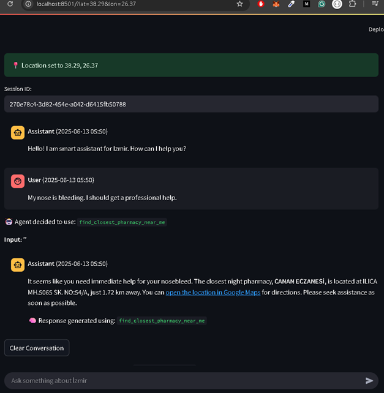
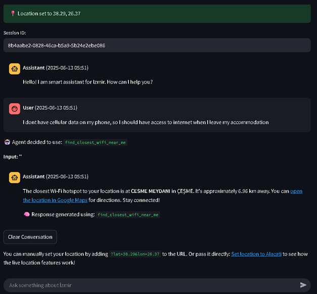
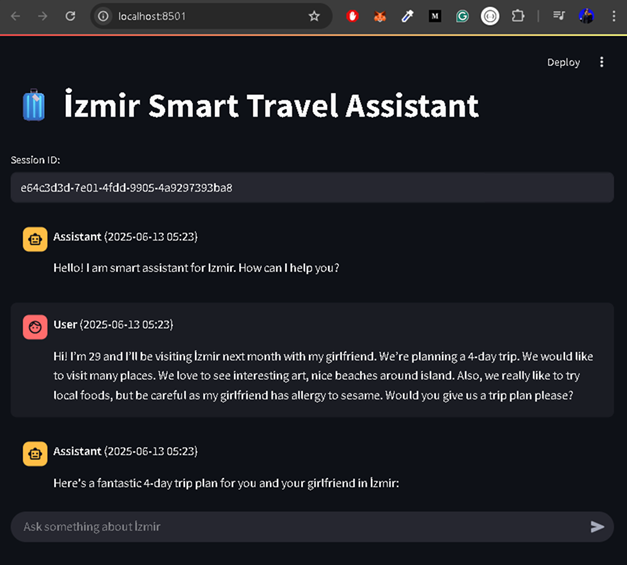
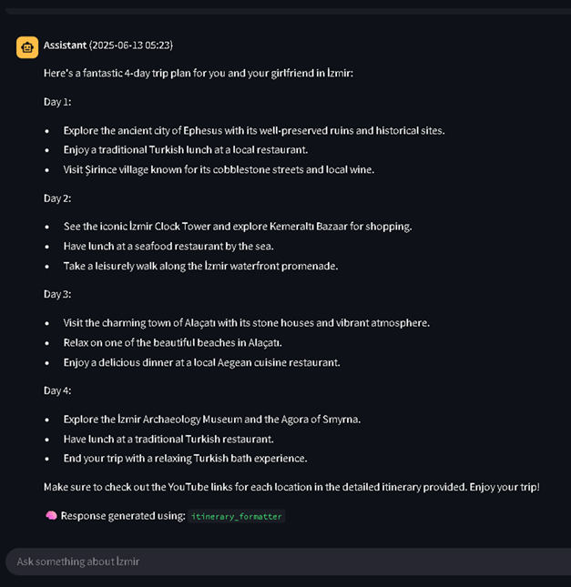
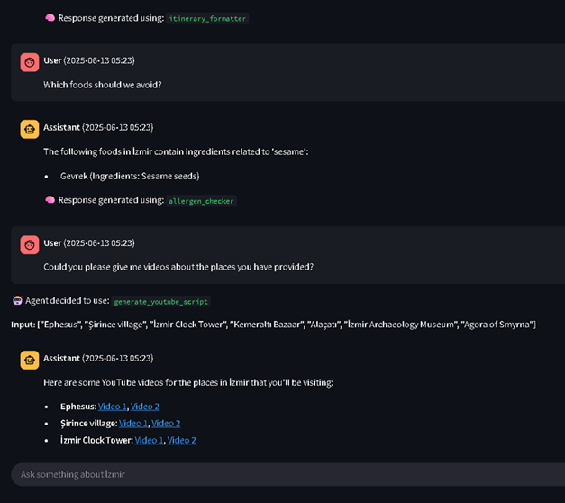
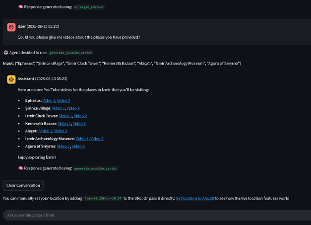

# 🧳 Smart Travel Assistant for İzmir

A LangChain-powered AI travel assistant that helps users plan personalized trips in İzmir, Turkey by leveraging a knowledge graph, semantic search (RAG), and real-time utility APIs.

Developed as part of the [Patika.dev x NewMind AI Bootcamp](https://www.patika.dev).

---

## 🌍 Project Overview

Despite advances in AI, trip planning is still a manual and fragmented process. This project aims to change that by creating a travel assistant that understands user intent and provides insightful, context-aware answers about:

- Museums  
- Beaches, Bays, Islands etc. 
- Foods & Allergens
- Historical Sites 
- Wi-Fi Spots & Night Pharmacies 

It combines structured graph data (Neo4j), semantic retrieval (OpenAI embeddings), and generative reasoning (GPT-4o) into a single intelligent assistant.

---

## 🔧 Features

- Coreference resolution for better entity linking
- LLM-based chunking and feature extraction
- Canonical entity merging & validation
- Custom LangChain tools for travel-specific reasoning
- Dynamic RAG (Retrieval-Augmented Generation) via vector search
- Google Maps links, YouTube video fetching, night pharmacy locator, Wi-Fi hotspot lookup

---

## 📁 Project Structure

| Folder | Purpose |
|--------|---------|
| `create-kg/` | Builds the Neo4j knowledge graph with embeddings |
| `data_preparation/` | Data normalization, coref resolution, feature extraction |
| `configuration/` | LLMs, embeddings, prompts, Neo4j configs |
| `memory/` | LangChain memory using Neo4j chat history |
| `rag/` | Retrieval logic for multi-type vector search |
| `tool/` | Domain-specific tools (museum, food, etc.) |
| `agent/` | Tool-enabled LangChain agent definition |
| `root` | CLI and Streamlit apps, env config, requirements |

---

## 🛠️ Tech Stack

- **Neo4j** – Knowledge graph and vector index
- **LangChain** – Tool & agent framework
- **OpenAI** – Embeddings + GPT-4o for reasoning
- **Streamlit** – Web UI
- **Python** – Backend logic
- **Municipal APIs** – For live data (Wi-Fi, pharmacy, etc.)

---

## 🚀 Getting Started

### 1. Clone the repository

git clone https://github.com/mertolcaman/chatbot-final-project.git
cd izmir-smart-travel-assistant

### 2. Setup environment
python -m venv .venv
source .venv/bin/activate  # or .venv\Scripts\activate on Windows
pip install -r requirements.txt

### 3. Add environment variables
Create a .env file in the root directory:
OPENAI_API_KEY=your-openai-key
NEO4J_URI=bolt://localhost:7687
NEO4J_USERNAME=neo4j
NEO4J_PASSWORD=your-password
GOOGLE_MAPS_API_KEY=your-key

### 4. Create the Knowledge Graph
python create-kg/create_kg.py

### 5. Run the chatbot (CLI)
python chat.py

### 6. Run the Streamlit App
streamlit run app.py

---

### 7. Screenshoots from the App
There is such a text to set the location to Alacati. 

*Setting location to Alaçatı as the trip base.*
In that way, the live location features can be tested. It is possible to get the closest pharmacy location 
based on the day and time. In Turkey, there are also night pharmacies. So, if the time is later than 19.00 
or earlier than 10.00, it looks for the night pharmacies. Additionally, the closest free wifi location is 
found.

## Conversation-1:

*Automatically finds the nearest open night pharmacy using municipal API.*

## Conversation-2:

*Returns closest public Wi-Fi hotspot from WizmirNet.*

## Conversation-3:

*Recommends museums based on user interest (e.g., “architecture” or “history”).*

*Suggests beaches, islands, and hidden destinations using semantic search.*

*Identifies which dishes contain gluten or allergens based on ingredients.*

*Answers complex questions by combining Cypher QA, ratings, and RAG results.*

👤 Author
Mert Olcaman
MSc in Data Science – University of Sussex

---
